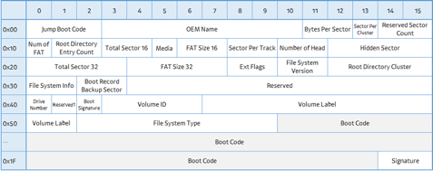
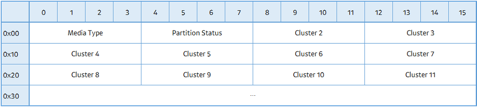
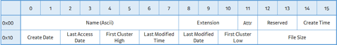
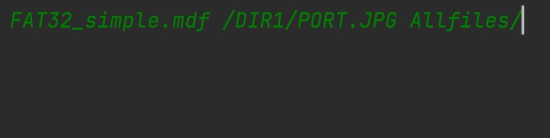
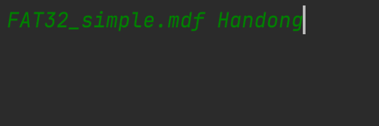

# FAT32
## 구조
- Architecture
- Boot Record
- FAT Area (Cluster Chain)
- Data Area (Directory Entry)
- Main 함수 및 동작확인

### Architecture
- FAT32
  - function (common)
    - [byteBuffer](): 데이터를 한 곳에서 다른 한 곳으로 전송하는 동안 일시적으로 그 데이터를 보관하는 임시 메모리 공간이다.
    - [fileIO](): 파일을 'rb', 즉 byte로된 파일을 읽거나 'wb' byte로 된 파일을 쓰기위한 function이다. (이때, seek과 read를 사용)
  - interface
    - [dataStore](): filename을 input으로 갖고 FileSystem으로 변환해주는 클래스로, 이때 파일과 디렉토리를 갖고 있는 정상적인 node를 FileSystem에 전달해준다.
    - [file](): fileSystem의 get_node함수를 통하여 filePath의 해당 노드를 return 받으며 해당 노드의 데이터와 경로를 가지고 사용자의 시스템 경로에 해당하는 곳에 export 해줄 수 있다.
    - [fileSystem](): root_mgmt를 input으로 갖고 filePath를 통하여 해당 노드를 return해주는 get_node함수를 호출할 수 있다.
  - layer_1
    - domain
      - [bootRecord](): FAT32파일의 bootRecord의 속성을 알려주는 객체이다.
      - [directoryEntry](): directoryEntryElements의 집합 객체이다.
      - [directoryEntryElements](): dir_offset을 통해 만들어 낸 데이터의 속성을 가진 객체이다.
      - [fatTable](): 데이터 영역의 클러스터 할당 상태를 알려주는 테이블 객체이다.
    - service (모두 filename을 input으로 가진다.)
      - [bootRecordService](): bootRecord 객체를 control할 수 있는 서비스 객체이다.
      - [directoryEntryService](): directoryEntry 객체를 control할 수 있는 서비스 객체이다.
      - [fatTableService](): fatTable 객체를 control할 수 있는 서비스 객체이다.
  - layer_2
    - domain
      - [clusterChain](): 하나의 파일이 할당하는 클러스터의 양과 (클러스터의 offset, size)를 관리하기 위한 객체이다.
      - [node](): 노드를 구성하는 속성을 알려주는 객체이다.
      - [nodeStream](): 노드관리와 path를 관리하는 속성을 가진 객체이다.
    - service
      - [clusterChainService](): clusterChain 객체를 control하는 서비스 객체이다.
      - [nodeService](): node 객체를 control하는 서비스 객체
      - [nodeStreamService](): nodeStream객체를 control하는 서비스 객체
  - layer_3
    - service
      - [fatSystemService](): layer1, 2에 있는 서비스를 통하여 전반적인 fat 파일과 디렉토리를 구성하는 Node를 생성해주는 서비스 객체이다.

### Boot Record

- Boot Record 정보: 0x60 bytes
- Bytes Per Sector(11~12): 저장장치의 입출력 단위 섹터 Byte 크기 (일반적으로 0x200)
- Sector Per Cluster(13): FAT32의 입출력 단위인 클러스터 섹터 수
- Cluster Size: Bytes Per Sector(11 ~ 12) * Sector Per Cluster
- Reserved Sector Count(14): Reserved Area 섹터 수
  - 이를 통하여 FAT #1 Offset을 구할 수 있다.
  - FAT #1 Offset = Reserved Sector Count(14) * Bytes Per Sector(11~12)
- Num of FAT(16): FAT의 개수 (주로 0x02)
  - FAT Area의 크기 계산시 사용된다.
- num_of_sector_FAT_area(36~39) : 한 FAT 내의 섹터 수
  - Num of FAT와 조합하여 FAT Area 크기 계산
    - FAT Area Size = Num of FAT(16) * (num_of_sector_FAT_area(36~39) * Bytes Per Sector(11~12))
  - Data Area Offset = FAT #1 Offset(FAT영역의 시작 주소) + FAT Area Size

### FAT Area

- Data Area의 각 클러스터의 사용여부를 확인하기 위함
- 데이터가 여러 클러스터로 분할되어 저장되면 클러스터 체인으로 표현된다.
- FAT Entry 하나의 크기는 4Bytes
- 파일 바이트 데이터가 나눠진 상태로 분포하기 때문에 FAT Table을 이용하여 용이하게 사용하기 위함.

|Value|Description|
|---|---|
|0x0000000|할당되지 않은 클러스터|
|0x0000002 ~ 0xFFFFFEF|사용중인 클러스터이며, 클러스터 체인의 다음 클러스터 번호|
|0xFFFFFF0 ~ 0xFFFFFF6|Reserved 클러스터|
|0xFFFFFF7|사용할수없는 Bad Cluster|
|0xFFFFFF8 ~ 0xFFFFFFF| EOF|

### Data Area

- File의 실제 데이터 저장 위치
- Directory인 경우 내부 File의 메타 데이터를 저장하는 Directory Entry 저장
- Directory Entry Size: 32 bytes

- File name: 0 ~ 7
- Extension: 8 ~ 10
- Attribute: 11

|Value|Description|
|---|---|
|0x01|Read Only|
|0x02|Hidden|
|0x04|System|
|0x08|Volume Label|
|0x0F|LFN(Long File Name)|
|0x10|Directory|
|0x20|Archive|
|0x40|Device|
|0x80|Reserved|

  - First Cluster High: 20 ~ 21
  - First Cluster Low: 26 ~ 27
  - First_cluster: First Cluster Low + First Cluster High의 리틀엔디안
  - File Size: 28 ~ 31 (디렉토리의 경우 항상 0, 최대 크기는 4GB)

### Main 함수 및 동작 확인
- 메인화면 실행(특정 경로파일만 가져오기)
  - 입력
  
  - 출력
  
- 메인화면 실행(전체 파일 가져오기)
  - 입력
  
  - 출력
  